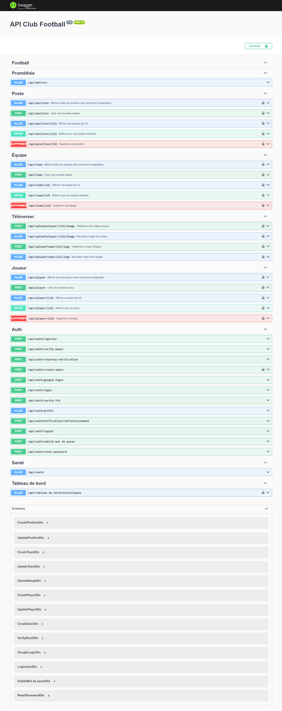

## Backend API – NestJS + Prisma + Auth + CRUD Football club

API backend complète construite avec NestJS, Prisma, PostgreSQL, sécurisée avec JWT, Refresh Tokens, Roles & Permissions, Cookies HttpOnly et comprenant des modules métier (Players, Teams, Positions) etc...
Inclut également du monitoring (Prometheus + Grafana) et du tracking d’erreurs (Sentry).

**NB :** (Ce projet est un prototype d’API en cours de développement. La logique métier principale est fonctionnelle.)


**Objectif** : L’objectif de ce projet est de développer une API backend complète dédiée à la gestion du football, permettant d’administrer des joueurs, des équipes et des postes etc.., tout en s’appuyant sur une architecture moderne et sécurisée.

##  Fonctionnalités
- Inscription & connexion sécurisées (JWT + Refresh Token)
- Inscription & connexion sécurisées reseaux social google avec (OAuth)
- Hybride Cookies HttpOnly + header Bearer token
- Verification par mail (USER)
- Verification 2FA (ADMIN & SUPERADMIN)
- Réinitialisation de mot de passe
- Gestion des rôles (USER, ADMIN, SUPERADMIN) RBAC
- Protection des routes (Guards & Decorators)
- Guards d’autorisation (JwtAuthGuard, RolesGuard)
- Permissions associées aux rôles
- Tentatives d’inscription enregistrées (SignupAttempt)
- Rate limiting avec Throtller (anti brute-force)
- Monitoring Prometheus + Grafana
- Logs structurés (Winston)
- Sentry (errors & performance)
- Gestions des joueur, equipe, poste etc..
- CRUD complet avec recherche, filtrage et pagination
- USER Multi-Tenant
- Upload (Cloudinary storage) images de joueurs, logos d’équipes, documents…
- Test unitaire jest et E2E supertest
- seed prisma
- Docker
- CI/CD
- Github Action

##  Fonctionnalités à venir (feature) 
- Ajout et mise en place de nouveaux modules métier (en cours...)
- Club
- ClubMember
- Match
- PlayerStats

##  Stack
- **NestJS**
- **NodeJS**
- **TypeScript**
- **Prisma ORM**
- **JWT**
- **Cookies HttpOnly**
- **OAuth**
- **PostgreSQL**
- **Swagger**
- **Docker**
- **Test unitaire jest**
- **Test E2E supertest**
- **Winston**
- **Sentry**
- **Prometheus / Grafana**
- **Throtller**
- **Brevo**
  

##  Modules métier – CRUD complet

Players
- CRUD complet des joueurs
- Association à un poste (Position)
- Association à une équipe (Team)
- Pagination, filtrage et recherche

Teams
- Création & gestion des équipes
- Relation avec les joueurs
- Pagination, filtrage et recherche

Positions
- Gestion des postes (nom unique)
- Association automatique avec les joueurs
- Pagination, filtrage et recherche


**Autre Module**

- Auth (JWT, Google login, 2FA, reset & forgot password etc...)
- Upload system
- Prometheus metrics
- Dashboard statistics
- Health check


## Prisma – Modèles utilisés
- User
- Role
- Permission
- SignupAttempt
- Player
- Team
- Position

##  Variables d’environnement (.env)

Copiez le fichier .env.example puis adaptez les valeurs selon votre environnement (local, test ou production) 


## Infrastructure

Backend API deployer sur **Render**
Production URL: https://api-football-gfpz.onrender.com

- Hosting: Render
- Database: PostgreSQL (Render)
- CI/CD: GitHub Actions
- Environment: Production-ready


## API Documentation 

Swagger UI:



Une documentation Swagger est disponible: https://api-football-gfpz.onrender.com/docs

## Architecture du projet


```bash

API-FOOTBALL/
│
├── .github/
│   └── workflows/                # Automatisation CI/CD
|       ├── ci.yml
│       └── cd.yml
│
├── docs/
|   └── images/                    # Swagger UI preview
│
├── prisma/                        # Database schema & migrations
│
├── src/
│   ├── auth/                      # Authentication (JWT, Google login, 2FA, reset & forgot password etc...) & authorization logic
│   │
│   ├── common/
│   │   ├── dtos/
│   │   ├── interfaces/
│   │   └── guards/
│   │
│   ├── config/                     # App configuration
│   ├── dashboard/                  # Dashboard statistics
│   ├── health/                     # Health checks
│   ├── logger/                     # Logging system
│   ├── mail/                       # Email service
│   ├── player/                     # Player management
│   ├── position/                   # Position management
│   ├── prisma/                     # Prisma service layer
│   ├── prometheus/                 # Metrics & monitoring
│   ├── sentry/                     # Error tracking
│   ├── team/                       # team management
│   ├── upload/                     # File upload management
│   │
│   ├── app.controller.ts
│   ├── app.module.ts
│   ├── app.service.ts
│   └── main.ts
│
├── test/                            # Unit & e2e tests
│
├── .gitignore
├── .dockerignore
├── Dockerfile
├── docker-compose.yml
├── package.json
├── tsconfig.json
└── README.md

```


## Démarrage
```bash
git clone https://github.com/SamiTelo/API-Football
cd  API-Football
npm install
npm run start:dev
```

##  Scripts utiles
```bash
npm run migrate       # Migration Prisma
npm run studio        # Prisma Studio
npm run build
```

##  Auteur
- **Tiemtore Samuel**
- Email: [samueltiemtore10@gmail.com](mailto:samueltiemtore10@gmail.com)

## Licence
Ce projet est sous licence MIT.

